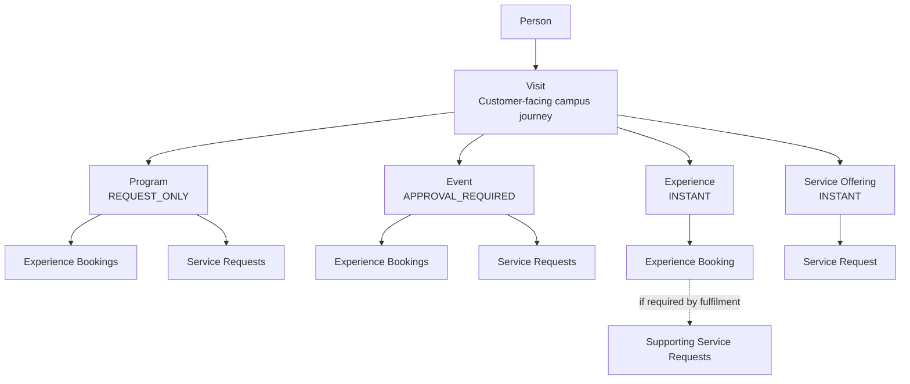
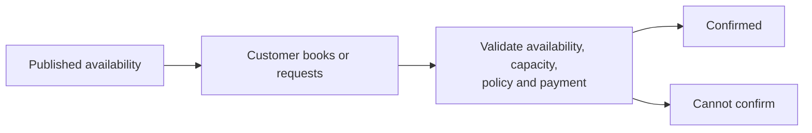
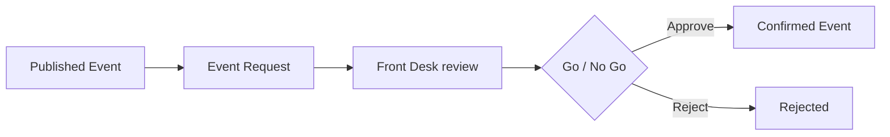
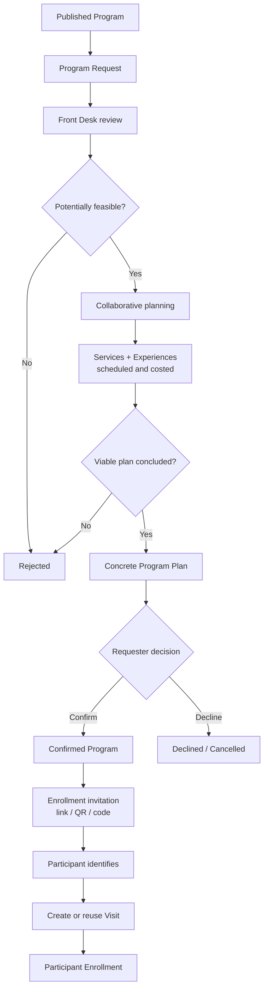

# Commons Domain Model and Ubiquitous Language

> Status: Proposed product and architecture baseline  
> Updated: 19 September 2026  
> Applies to: Product, Design, Engineering, Operations and Quality

## Purpose

This document defines the shared language used across Commons. The same terms should be used in product discussions, user stories, interface labels, API contracts, persistence models and test plans.

Commons presents four kinds of public Activity Definition:

1. Programs;
2. Events;
3. Experiences; and
4. Service Offerings.

These definitions describe what people can discover when planning a Visit. Published availability determines when an Activity can be requested or booked. Confirmed Programs and Events may coordinate both Experiences and services without collapsing them into one transaction.

## Core rule

> Commons publishes Programs, Events, Experiences and Service Offerings as Activity Definitions that people can discover when planning a Visit. Availability determines when an Activity can be requested or booked. Programs use `REQUEST_ONLY` because they require collaborative planning; Events use `APPROVAL_REQUIRED` because their date, venue and commercial commitment require review; Experiences and Service Offerings use `INSTANT` where published availability has already been planned and can be safely committed by the system. Confirmed Programs and Events may coordinate Experience Bookings and Service Requests, while a Service Request remains the smallest independently actionable unit of service fulfilment.

A Service Offering becomes a Service Request when a customer requests it. An Experience Instance becomes an Experience Booking when a participant reserves it. Higher-order Activities such as Programs, Events and Experiences may result in supporting Service Requests where their delivery requires services.

A unit is independently actionable when it can be accepted, rejected, changed, assigned, priced, scheduled, paid, fulfilled, cancelled and audited without forcing every other part of the parent Visit, Program, Event or Experience Booking to change with it.

## Concept map

The public boundary is Visit- and customer-intent-centric. The catalogue is Activity-centric. Operational fulfilment is coordinated through bookings and requests:

- Customer journey: `Person → Visit`;
- Public catalogue: `Program | Event | Experience | Service Offering`;
- Operations: `Requests/Bookings → Resources → Tasks → Fulfilment`.

## Definitions

### Campus

The permanent operational, configuration and authorization boundary for a Commons deployment.

A Campus owns its catalogue, resources, policies, availability, staff scopes and operational records.

### Person

An individual interacting with Commons as a visitor, participant, organizer or staff member.

A Person is not the same as an account. Guest-first workflows may identify a Person only when necessary.

### Program

A reusable Activity Definition for a structured participant journey, usually composed of several Experiences, services or both.

Examples:

- a camp;
- a retreat;
- a leadership intensive.

A Program uses `REQUEST_ONLY` booking mode because the customer's initial requirements are not yet a plan that Commons can confirm. Front Desk must assess feasibility and may reject the request immediately. If it is potentially feasible, Front Desk works with the requester to schedule and cost the required Experiences and services. Planning may still end in rejection when no viable plan can be concluded. Otherwise, Front Desk proposes a concrete Program Plan for the requester to confirm or decline.

A camp is a specific kind of Program. The requested or confirmed Program is the coordinating aggregate, not one oversized Service Request.

Only after the requester confirms the concrete Program Plan does Commons create an Enrollment Invitation. The invitation may be shared as a link, QR code or code and lets participants identify themselves and enrol in that confirmed Program.

A confirmed Program may contain:

- agreed dates and organizer;
- attendee roster;
- participant groups;
- Service Requests;
- Experience Bookings;
- shared schedule;
- documents and declarations;
- consolidated commercial summary;
- operational readiness;
- immutable history.

### Event

A reusable Activity Definition for a scheduled gathering or occasion that people may attend and around which Experience Bookings and Service Requests may be coordinated.

Examples:

- a conference;
- a convention;
- a wedding;
- a concert;
- a special service.

An Event is not an Experience. An Experience describes what a participant does; an Event describes the gathering or occasion they attend. Events are normally simpler and shorter than Programs, often centred on one day, but may involve valuable facilities and significant commercial commitments.

An Event uses `APPROVAL_REQUIRED` booking mode. The customer submits a sufficiently concrete Event Request. Front Desk reviews feasibility and makes a go/no-go decision. Approval confirms the Event and its supporting commitments; rejection ends the request without a collaborative Program-planning phase.

### Camp

A Program subtype representing a coordinated, usually multi-day campus stay or gathering.

A Camp may require facilities, accommodation, meals, transport and equipment while also including prepaid Experiences.

Example:

- meals for all attendees;
- a campus Tour for all attendees;
- golf for the Leaders participant group;
- accommodation for residential attendees;
- transport for arrival groups.

### Participant and Participant Group

A Participant is a Person enrolled in a Program.

A Participant Group is a named subset used to target entitlements, bookings or services.

Examples:

- Everyone;
- Leaders;
- Youth participants;
- Day visitors;
- Residential attendees;
- Drivers;
- specifically selected participants.

Program components may target:

- all participants;
- one or more Participant Groups;
- selected named Participants;
- an unnamed quantity before the final roster is known;
- external guests.

### Enrollment Invitation and Participant Enrollment

An Enrollment Invitation is the controlled entry point through which a Person joins a confirmed Program. It may be represented as a shareable link, QR code or code. It is created only after the requester has confirmed the concrete Program Plan; a draft, rejected, planning, proposed or declined Program must not expose an active enrollment entry point.

Participant Enrollment records that a Person has joined a Program. Enrollment is not an Experience Booking, Service Request, payment or attendance record. When a participant identifies themselves, Commons creates or reuses the Person's Visit for the Program and links the Participant Enrollment to that Visit.

Enrollment may:

- add the Participant to the Program roster;
- assign default or selected Participant Groups;
- grant organizer-funded entitlements included in the confirmed Program Plan;
- expose optional Experiences or services that the Participant may choose separately; and
- preserve the confirmed plan and the participant's choices for audit.

Organizer-funded inclusions must not charge the participant again. Commons does not collect attendee contributions toward the organizer's Program payment. Provider-owned commerce, including food where Patatte is the owner, remains outside the Commons enrollment transaction.

### Activity Definition

A reusable catalogue definition representing something Commons presents for discovery, participation or coordination.

Definition types are:

- Program;
- Event;
- Experience;
- Service Offering.

This is the public catalogue layer: it answers what a visitor can join, attend, experience or request at the Campus. Definitions may carry human-facing names, descriptions, imagery, eligibility, pricing guidance and policies.

Definitions have lifecycle and visibility state. Publication makes a definition discoverable; valid availability makes it requestable or bookable for a particular date, slot or period. Definitions describe what exists, availability determines when it can be consumed, and requests or bookings record a customer's choice.

### Experience

A reusable participatory Activity such as a Campus Tour, golf session or prayer experience.

An Experience describes what participants do. It does not represent a customer's transaction or a dated occurrence.

An Experience uses `INSTANT` booking mode. Once an Experience Instance is published, its capacity, Resources, price and policies have already been planned sufficiently for Commons to confirm a booking automatically when the constraints and any required payment are satisfied.

An Experience can independently be the reason for a Visit or be included within a Program or Event. Its fulfilment may create supporting Service Requests, such as transport or refreshments. Those requests are delivery consequences and do not need to be booked separately by the visitor.

### Experience Instance

A scheduled occurrence of an Experience with availability, capacity, price, policy and assigned resources.

Examples:

- Campus Tour on 24 October at 10:00;
- golf session on 25 October at 15:00.

### Experience Booking

A reservation of participant access against a published Experience Instance.

An Experience Booking may be:

- an individual booking;
- a group booking;
- linked to a Program;
- organizer-funded;
- individually funded;
- complimentary or sponsored.

A group Experience Booking records the participant scope, reserved quantity, optional named attendees, payment responsibility and check-in state.

### Service Offering

A reusable definition of a capability the Campus or an integrated provider makes available.

Examples:

- Facility Booking;
- Accommodation Reservation;
- Meal Service;
- Campus Transport;
- Equipment Provision;
- Technical Support.

A Service Offering defines:

- what may be requested;
- who owns fulfilment;
- the request data required;
- applicable policies;
- booking mode;
- pricing basis;
- required resource types;
- fulfilment rules.

A Service Offering is not a customer transaction and does not consume availability.

A Service Offering uses `INSTANT` booking mode where published availability, Resources, price and policy are sufficiently known for Commons to confirm the resulting Service Request automatically. The Service Request remains the transaction and consumes or reserves the relevant availability.

Prefer broad offerings with separately managed Resources. For example, use the Facility Booking offering with the Great Hall Resource instead of creating a different offering for every hall.

### Service Request

The smallest independently actionable customer request for a Service Offering.

Examples:

- reserve the Great Hall on 20 October from 09:00 to 16:00;
- provide accommodation for 20 delegates from 14–17 October;
- deliver 100 lunches at 13:00;
- collect five guests from the main gate at 14:00;
- provide six microphones and two projectors.

Every Service Request must have an owning context. It may belong to a Program, Event, Experience Booking, participant Visit or another explicit coordination context. “Standalone” does not mean orphaned.

A Service Request records the actual transaction, including:

- requester;
- parent Program or Visit;
- Service Offering;
- requested dates, quantities and outcomes;
- selected or requested Resources;
- status and owning team;
- applicable policy snapshot;
- quote or price;
- payment state;
- allocation or reservation;
- fulfilment;
- cancellation;
- audit history.

The request may begin without an exact Resource. For example, an organizer may request accommodation for 20 delegates and allow Operations to allocate the rooms.

### Resource

A person, place, asset or constrained capacity used to fulfil a Service Request or operate an Experience Instance.

Examples:

- Great Hall;
- Room 204;
- Tuk Tuk 3;
- a projector;
- a Tour guide;
- an AV technician.

Resources own availability and operational state. They are not Service Offerings.

### Resource Allocation

The proposed assignment of one or more Resources to a Service Request.

An allocation may be provisional while a request is assessed.

### Reservation or Booking

The confirmed commitment of availability or capacity.

A Service Request expresses intent. Approval and payment may lead to a Reservation. The terms are therefore not interchangeable.

Examples:

- a Facility Request results in a Facility Reservation;
- an Accommodation Request results in Room Reservations;
- an Experience Booking directly reserves capacity in an Experience Instance.

### Order

A transactional specialization used where fulfilment is line-item based, such as meals or merchandise.

An Order may be represented by an integrated provider while Commons retains only the coordination reference required by its ownership boundary.

### Policy Pack

A versioned set of rules governing a Service Offering, Experience, Resource category, request type or Program.

A submitted request or booking must retain the applicable policy version or consequential snapshot. Later policy edits must not silently change an existing agreement.

Policies may govern:

- booking mode;
- advance-booking window;
- approval;
- capacity;
- deposit and payment deadlines;
- cancellation and refunds;
- required information;
- documents and declarations;
- setup and teardown buffers;
- operational checklists.

### Operational Task

Concrete internal work required to prepare, fulfil or close a Service Request or Experience Booking.

Examples:

- prepare hall seating;
- allocate rooms;
- set up microphones;
- inspect a facility;
- reconcile payment.

Tasks are not customer requests.

### Payment

A financial transaction associated with one or more payable Program components.

Commons may present a consolidated Program quote or invoice while retaining allocations to the underlying Service Requests and Experience Bookings for reconciliation, cancellation and refunds.

Payment confirmation is server-authoritative. A browser redirect alone never proves payment.

### Fulfilment

The evidence that the requested service or booked experience was delivered.

Examples:

- meals delivered;
- passengers dropped off;
- facility handed over;
- guests checked in;
- Tour attendance recorded;
- equipment returned and inspected.

### Visit

The customer-facing plan for how a Person intends to interact with the Campus.

A Program, Event, Experience or Service Offering can each independently be the reason for a Visit. A Visit may connect the Person to a Program request or enrolment, Event Request, Experience Booking, Service Request and access grants.

A Visit presents a coherent journey without replacing the operational aggregates beneath it. It must not make every group request participant-owned or collapse independently actionable bookings and requests into one transaction.

### Entitlement or Access Grant

A funded or authorized right for a Participant or Participant Group to consume a service or attend an Experience without paying again.

Examples:

- Campus Tour included for every camp attendee;
- golf included for Leaders;
- accommodation included for residential attendees.

## Activity composition

Programs and Events can coordinate multiple independently managed components. An Experience Booking may also create supporting Service Requests required for its fulfilment.

| Parent Activity | Component | Domain representation |
|---|---|---|
| Program | Great Hall for three days | Facility Service Request |
| Program | Accommodation for 100 attendees | Accommodation Service Request |
| Program | Three meals per attendee per day | Meal Service Request or provider Order context |
| Program | Airport or gate pickup | Transport Service Request |
| Program | Prepaid Campus Tour for everyone | Group Experience Booking targeting Everyone |
| Program | Golf for leaders | Group Experience Booking targeting Leaders |
| Event | Great Hall for one day | Facility Service Request |
| Event | AV equipment and support | Equipment and Technical Support Service Requests |
| Event | Optional Campus Tour | Experience Booking |
| Experience Booking | Required ride to the activity | Supporting Transport Service Request |

A Program or Event may become operationally ready only when all mandatory components satisfy their respective policies. Optional components may remain independent.

## Service Offering versus Service Request

| | Service Offering | Service Request |
|---|---|---|
| Meaning | What may be requested | A customer requesting it |
| Nature | Reusable catalogue definition | Individual transaction |
| Created by | Super Admin or configuration owner | Customer, organizer or staff acting for them |
| Availability | Defines how availability is evaluated | Requests or consumes specific availability |
| Policy | References current policy configuration | Preserves the accepted policy version |
| Price | Defines pricing basis | Holds the actual quote or price |
| Payment | Defines whether payment is required | Holds payment state |
| Fulfilment | Defines ownership and rules | Tracks actual delivery |
| Example | Facility Booking | Great Hall, 20 October, 09:00–16:00 |

## Service Request versus Experience Booking

Use a Service Request when the customer asks for an operational outcome that must be fulfilled or assessed.

Use an Experience Booking when participants reserve access to a scheduled participatory activity.

| Customer need | Representation |
|---|---|
| “Provide lunch for 100 people” | Service Request |
| “Reserve rooms for 20 delegates” | Service Request |
| “Prepare the Great Hall” | Service Request |
| “Book the published 10:00 Campus Tour” | Experience Booking |
| “Reserve golf for the Leaders group” | Experience Booking |
| “Provide a private custom Tour outside published availability” | Service Request that may create a managed Experience Booking |

## Booking modes and lifecycle boundaries

Booking mode belongs to the Activity Definition and expresses how customer intent becomes a confirmed activity. The modes represent how much operational planning has been completed before publication.

| Booking mode | Activity types | Decision being made |
|---|---|---|
| `INSTANT` | Experience, Service Offering | Can the system confirm this from known availability and rules? |
| `APPROVAL_REQUIRED` | Event | Is the customer's sufficiently concrete proposal acceptable? |
| `REQUEST_ONLY` | Program | Can Front Desk construct an acceptable plan from the customer's requirements? |

### INSTANT — Experience and Service Offering

Operational planning has occurred before publication. Commons confirms the Experience Booking or Service Request automatically when current availability, capacity, policy and payment requirements are satisfied.

### APPROVAL_REQUIRED — Event

An Event Request is sufficiently concrete to assess. Front Desk approves or rejects it; it does not require the collaborative planning cycle used for a Program.

### REQUEST_ONLY — Program

`REQUEST_ONLY` does not imply eventual approval. Front Desk may reject the initial request, or planning may end without a viable plan. Only a concrete plan that the requester accepts becomes a confirmed Program.

### Post-confirmation Program enrollment

The Enrollment Invitation belongs to the confirmed Program and provides the public entry point; it does not itself make someone a Participant. After identification, Commons creates or reuses the Person's Program Visit, records one Participant Enrollment, applies the appropriate Participant Groups and resolves the entitlements funded by the organizer's confirmed plan.

Included Experiences and services are exposed as entitlements or access grants, not as a second participant charge. Optional participant choices remain distinct transactions or selections according to the component's policy. Enrollment, booking, attendance, service usage and payment remain separate measures.

### Component lifecycles

A confirmed Program or Event aggregates the readiness of its Experience Bookings and Service Requests without overwriting their individual lifecycles. Supporting components remain independently actionable, auditable and cancellable according to policy.

Suggested Program readiness states are:

- Draft;
- Under Review;
- Planning;
- Plan Proposed;
- Confirmed;
- Partially Ready;
- Ready;
- In Progress;
- Completed;
- Rejected;
- Declined or Cancelled;
- Archived.

## Ownership boundaries

Commons may coordinate services fulfilled by another system.

The authoritative owner of catalogue, price, payment, order and fulfilment must remain explicit.

Current examples:

- Commons owns native Campus Tour scheduling, booking and check-in.
- Patatte/VendorOS owns Food and Merchandise commerce.
- Commons may link a Program to an external order or storefront context without duplicating the provider's commercial aggregate.
- Commons owns Paystack state only for Commons-owned payments.

## Invariants

1. Program, Event, Experience and Service Offering are public Activity Definition types.
2. Publication makes an Activity discoverable; valid availability makes it requestable or bookable.
3. A Visit may originate from any public Activity Definition.
4. A Program is not a Service Request.
5. An Event is not an Experience.
6. A Camp is a Program subtype.
7. Programs use `REQUEST_ONLY`; Events use `APPROVAL_REQUIRED`; Experiences and Service Offerings use `INSTANT`.
8. A `REQUEST_ONLY` Program may be rejected before or during planning and is confirmed only after the requester accepts a concrete Program Plan.
9. A Service Offering is a definition; a Service Request is a transaction.
10. An Experience is a definition; an Experience Instance is dated availability; an Experience Booking is a reservation.
11. A Resource is allocated to fulfil a request or operate an Experience Instance.
12. A Service Request is the smallest independently actionable unit of service fulfilment.
13. Service Requests must not be orphaned.
14. A Program or Event may contain both Service Requests and Experience Bookings.
15. An Experience Booking may create supporting Service Requests required for fulfilment.
16. Participant targeting must support all attendees, groups, named attendees and quantity-only reservations.
17. Confirmed resource commitments must be conflict-checked.
18. Booked, paid, fulfilled and historical records must not be cascade-deleted.
19. Accepted policy terms must remain historically reproducible.
20. External-system ownership must not be obscured by Commons orchestration.
21. Payment confirmation must be server-authoritative and idempotent.
22. A consolidated Program or Event financial view must retain allocations to its component transactions.
23. An Enrollment Invitation may be created only for a confirmed Program after the requester accepts its concrete Program Plan.
24. Participant Enrollment links a Person to a Program and creates or reuses that Person's Program Visit; it is not a booking, request, payment or attendance record.
25. Organizer-funded Program inclusions become participant entitlements and must not charge the participant again.
26. Commons does not collect attendee contributions toward the organizer's Program payment.
27. Enrollment, Participant Group membership, entitlement, optional selection, attendance and service usage remain independently auditable.

## Naming guidance

Use these terms consistently:

- “offering” for a reusable capability;
- “request” for one customer ask;
- “resource” for the person, place or asset that fulfils it;
- “allocation” for a proposed assignment;
- “reservation” or “booking” for a confirmed commitment;
- “visit” for the customer-facing Campus journey;
- “experience” for what a participant does;
- “event” for a gathering or occasion;
- “program” for a structured, collaboratively planned participant journey;
- “enrollment invitation” for the confirmed Program's shareable join entry point;
- “participant enrollment” for a Person joining a Program;
- “entitlement” for organizer-funded or otherwise authorized access without another charge;
- “task” for internal work;
- “fulfilment” for delivered outcome.

Avoid:

- using “request” and “booking” interchangeably;
- calling a physical Facility or an Event an Experience;
- treating a Camp or Program as one Service Request;
- describing `REQUEST_ONLY` as guaranteed approval;
- creating an enrollment invitation before the Program Plan is confirmed;
- treating enrollment as a booking, payment or attendance record;
- charging a participant again for an organizer-funded inclusion;
- creating a Service Offering for every individual room or vehicle;
- treating operational Tasks as customer-facing requests;
- copying provider-owned commerce records into Commons as if Commons owned them.
